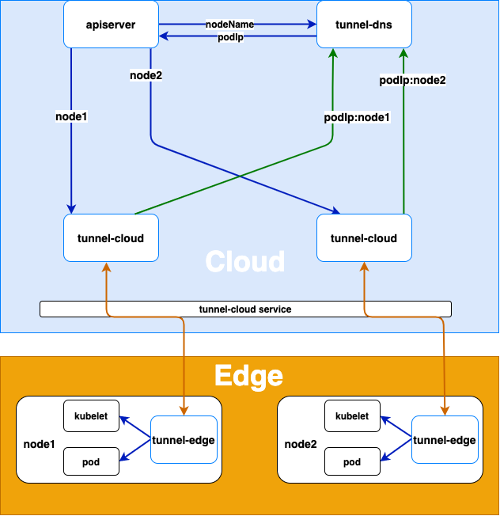

# tunnel

tunnel是云边端通信的隧道，分为tunnel-cloud和tunnel-edge，分别承担云边隧道的两端

## 作用
- 代理云端请求访问边缘组件，解决云边端无法直接通信的问题（边缘节点无公网IP）；

## 架构图

- node1和node2为边缘节点，tunnel-cloud将接收到请求的对应edge node（node1、2）和自身的pod Ip的mapping写入dns
- 当apiserver需要访问edge node（根据node name），根据上述dns规则，tunnel dns会返回实际和tunnel edge node连接的tunnel-cloud ip，从**而请求转发到tunnel-cloud的pod**，cloud个对应tunnel-edge建立grpc连接

<div align="left">
  
</div>

## 实现方案
### 节点注册
   - 边缘节点上tunnel-edge主动连接云端tunnel-cloud service,service根据负载均衡策略将请求转到tunnel-cloud的pod。
   - **tunnel-edge与tunnel-cloud建立grpc连接**后，tunnel-cloud会把自身的podIp和tunnel-edge所在节点的nodeName的映射写入DNS。grpc连接断开之后，tunnel-cloud会删除podIp和节点名映射。

### 请求的代理转发
   - apiserver或者其它云端的应用访问边缘节点上的kubelet或者其它应用时,tunnel-dns通过DNS劫持(将host中的节点名解析为tunnel-cloud的podIp)把请求转发到tunnel-cloud的pod。
   - tunnel-cloud根据节点名把请求信息转发到节点名对应的与tunnel-edge建立的grpc连接。
   - tunnel-edge根据接收的请求信息请求边缘节点上的应用。

# tunnel模块分析

参考

- https://blog.csdn.net/yunxiao6/article/details/117023803
- https://github.com/khalid-jobs/tunnel

## Tunnel内部模块数据交互

下图为 HTTPS 代理的数据流转，TCP 代理数据流转和 HTTPS 的类似，其中的关键步骤：

- HTTPS Server -> StreamServer（2）：**HTTPS Server 通过 Channel将 StreamMsg 发送给 Stream Server**，其中的 Channel 是根据 StreamMsg.Node 字段从 nodeContext 获取 node.Channel

- StreamServer -> StreamClient（3）: 每个**云边隧道都会分配一个 node 对象，将StreamMsg发送到 node（隧道对应的edge node） 中的 Channel** 即可把数据发往 StreamClient

- StreamServer -> HTTPS Server（5）: StreamServer **通过 Channel 将 StreamMsg 发送给 HTTPS Server**，其中的 Channel 是根据 StreamMsg.Node从nodeContext 获取 node，通过 StreamMsg.Topic 与 conn.uid 匹配获取 HTTPS 模块的 conn.Channel

nodeContext 和 connContext 都是做连接的管理，但是 **nodeContext 管理 gRPC 长连接的和 connContext 管理的上层转发请求的连接(TCP 和 HTTPS)的生命周期是不相同的，因此需要分开管理**


## Tunnel连接管理

Tunnel 管理的连接可以分为**底层连接(云端隧道的 gRPC 连接)和上层应用连接(HTTPS 连接和 TCP 连接)**，连接异常的管理的可以分为以下几种场景：

- gRPC 连接正常，上层连接异常：以 HTTPS 连接为例，tunnel-edge 的 HTTPS Client 与边缘节点 Server 连接异常断开，会发送 StreamMsg **(StreamMsg.Type=CLOSE)** 消息，tunnel-cloud 在接收到 StreamMsg 消息之后会主动关闭 HTTPS Server与HTTPS Client 的连接。
- gRPC 连接异常：gRPC 连接异常，Stream 模块会根据与 gPRC 连接绑定的 node.connContext，向 HTTPS 和 TCP 模块发送 StreamMsg(StreamMsg.Type=CLOSE)，HTTPS 或 TCP 模块接收消息之后主动断开连接。

## Stream模块

- **Stream 模块负责建立 gRPC连接以及通信(云边隧道)**
- **边缘节点上 tunnel-edge 主动连接云端 tunnel-cloud service**，tunnel-cloud service 根据负载均衡策略将请求转到tunnel-cloud pod
- tunnel-edge 与 tunnel-cloud 建立 gRPC 连接后，tunnel-cloud 会把自身的 podIp 和 tunnel-edge 所在节点的 nodeName 的映射写入**tunnel-coredns**。gRPC 连接断开之后，tunnel-cloud 会删除相关 podIp 和节点名的映射
- tunnel-edge 会利用边缘节点名以及 token 构建 gRPC 连接，**而 tunnel-cloud 会通过认证信息解析 gRPC 连接对应的边缘节点（一个cloud可能对应对个edge node）**，并对每个边缘节点分别构建一个 wrappedServerStream 进行处理(同一个 tunnel-cloud 可以处理多个 tunnel-edge 的连接)
- **tunnel-cloud** 每隔一分钟(考虑到 configmap 同步 tunnel-cloud 的 pod 挂载文件的时间)**向 tunnel-coredns 的 hosts 插件的配置文件对应 configmap 同步**一次边缘节点名以及 tunnel-cloud podIp 的映射
  - **下图**
- tunnel-edge **每隔一分钟会向 tunnel-cloud 发送代表该节点正常的心跳 StreamMsg**，而 tunnel-cloud 在接受到该心跳后会进行回应(心跳是为了探测 gRPC Stream 流是否正常)
- **StreamMsg类型： 包括心跳，TCP 代理以及 HTTPS 请求等不同类型消息**
- tunnel-cloud **通过 context.node 区分与不同边缘节点 gRPC 连接隧道**


## Https代理模块

- HTTPS：负责**建立云边 HTTPS 代理**(eg：云端 kube-apiserver <-> 边端 kubelet)，并传输数据
- 作用与 TCP 代理类似，不同的是 **tunnel-cloud 会读取云端组件 HTTPS 请求中携带的边缘节点名，并尝试建立与该边缘节点的 HTTPS 代理**；而**不是像 TCP 代理一样随机选择一个云边隧道**进行转发
- 云端 apiserver 或者其它云端的应用访问边缘节点上的 kubelet 或者其它应用时,tunnel-dns 通过DNS劫持(将 Request host 中的节点名解析为 tunnel-cloud 的 podIp)把请求转发到 tunnel-cloud 的pod上,tunnel-cloud 把请求信息封装成 StreamMsg 通过与节点名对应的云边隧道发送到 tunnel-edge，tunnel-edge 通过接收到的 StreamMsg 的 Addr 字段和配置文件中的证书与边缘端 Server 建立 TLS 连接，并将 StreamMsg 中的请求信息写入 TLS 连接。tunnel-edge 从 TLS 连接中读取到边缘端 Server 的返回数据，将其封装成 StreamMsg 发送到 tunnel-cloud，tunnel-cloud 将接收到数据写入云端组件与 tunnel-cloud 建立的连接中。
  

## TCP代理模块

- TCP：负责在**多集群管理中建立云端与边端的 TCP 代理**
- **云端组件通过 TCP 模块访问边缘端的 Server**：云端的 TCP Server 在接收到请求会将请求封装成 StreamMsg 通过云边隧道(在已连接的隧道中随机选择一个，因此推荐在只有一个 tunnel-edge 的场景下使用 TCP 代理)发送到 tunnel-edge，tunnel-edge 通过接收到 StreamMag 的Addr字段与边缘端 Server 建立TCP 连接，并将请求写入 TCP 连接。tunnel-edge 从 TCP 连接中读取边缘端 Server 的返回消息，通过云边缘隧道发送到tunnel-cloud，tunnel-cloud 接收到消息之后将其写入云端组件与 TCP Server 建立的连接

# 源码分析

## 依赖关系

https://www.dumels.com/diagram/be3a3cbc-7123-4e15-9b1c-be34c600bca8

)

## 配置文件分析

tunnel组件包括**tunnel-cloud**和**tunnel-edge**，运行在边缘节点**tunnel-edge**与运行在云端的**tunnel-cloud**建立gRPC长连接，用于云端转发到边缘节点的隧道。

### tunnel-cloud

**tunnel-cloud**包含**stream**、**TCP**和**HTTPS**三个模块。

其中**stream模块**包括gRPC server和DNS组件，gRPC server用于接收**tunnel-edge**的gRPC长连接请求，DNS组件用于把**tunnel-cloud**内存中的节点名和IP的映射更新到coredns hosts插件的configmap中。

> tunnel-cloud配置文件：tunnel-cloud-conf.yaml

```yaml
apiVersion: v1
kind: ConfigMap
metadata:
  name: tunnel-cloud-conf
  namespace: kube-system
data:
  tunnel_cloud.toml: |
    [mode]
      [mode.cloud]
        [mode.cloud.stream]                             # stream模块
          [mode.cloud.stream.server]                    # gRPC server组件
            grpcport = 9000                             # gRPC server监听的端口
            logport = 8000                              # log和健康检查的http server的监听端口，使用(curl -X PUT http://podip:logport/debug/flags/v -d "8")可以设置日志等级
            channelzaddr = "0.0.0.0:6000"               # gRPC [channlez](https://grpc.io/blog/a-short-introduction-to-channelz/) server的监听地址，用于获取gRPC的调试信息
            key = "../../conf/certs/cloud.key"          # gRPC server的server端私钥
            cert = "../../conf/certs/cloud.crt"         # gRPC server的server端证书
            tokenfile = "../../conf/token"              # token的列表文件(nodename:随机字符串)，用于验证边缘节点tunnel-edge发送的token，如果根据节点名验证没有通过，会用default对应的token去验证
          [mode.cloud.stream.dns]                       # DNS组件
            configmap= "proxy-nodes"                    # coredns hosts插件的配置文件的configmap
            hosts = "/etc/superedge/proxy/nodes/hosts"  # coredns hosts插件的配置文件的configmap在tunnel-cloud pod的挂载文件的路径
            service = "proxy-cloud-public"              # tunnel-cloud的service name
            debug = true                                # DNS组件开关，debug=true DNS组件关闭，**tunnel-cloud** 内存中的节点名映射不会保存到coredns hosts插件的配置文件的configmap，默认值为false
        [mode.cloud.tcp]                                # TCP模块
          "0.0.0.0:6443" = "127.0.0.1:6443"             # 参数的格式是"0.0.0.0:cloudPort": "EdgeServerIp:EdgeServerPort"，cloudPort为tunnel-cloud TCP模块server监听端口，EdgeServerIp和EdgeServerPort为代理转发的边缘节点server的IP和端口
        [mode.cloud.https]                              # HTTPS模块
          cert ="../../conf/certs/kubelet.crt"          # HTTPS模块server端证书
          key = "../../conf/certs/kubelet.key"          # HTTPS模块server端私钥
          [mode.cloud.https.addr]                       # 参数的格式是"httpsServerPort":"EdgeHttpsServerIp:EdgeHttpsServerPort"，httpsServerPort为HTTPS模块server端的监听端口，EdgeHttpsServerIp:EdgeHttpsServerPort为代理转发边缘节点HTTPS server的IP和port，HTTPS模块的server是跳过验证client端证书的，因此可以使用(curl -k https://podip:httpsServerPort)访问HTTPS模块监听的端口，addr参数的数据类型为map，可以支持监听多个端口
            "10250" = "101.206.162.213:10250"

```

### tunnel-edge

**tunnel-edge**同样包含**stream**、**TCP**和**HTTPS**三个模块。其中**stream模块**包括gRPC client组件，用于向 **tunnel-cloud**发送gRPC长连接的请求。

> tunnel-edge 配置文件：tunnel-edge.yaml

```yaml
apiVersion: v1
kind: ConfigMap
metadata:
  name: tunnel-edge-conf
  namespace: kube-system
data:
  tunnel_edge.toml: |
    [mode]
      [mode.edge]
        [mode.edge.stream]                              # stream模块
          [mode.edge.stream.client]                     # gRPC client组件
            token = "6ff2a1ea0f1611eb9896362096106d9d"  # 访问tunnel-cloud的验证token
            cert = "../../conf/certs/ca.crt"            # tunnel-cloud的gRPC server 的 server端证书的ca证书，用于验证server端证书
            dns = "localhost"                           # tunnel-cloud的gRPC server证书签的IP或域名
            servername = "localhost:9000"               # tunnel-cloud的gRPC server的IP和端口
            logport = 7000                              # log和健康检查的http server的监听端口，使用(curl -X PUT http://podip:logport/debug/flags/v -d "8")可以设置日志等级
            channelzaddr = "0.0.0.0:5000"               # gRPC channlez server的监听地址，用于获取gRPC的调试信息
        [mode.edge.https]                               # HTTPS模块
          cert= "../../conf/certs/kubelet-client.crt"   # tunnel-cloud 代理转发的HTTPS server的client端的证书
          key= "../../conf/certs/kubelet-client.key"    # **tunnel-cloud** 代理转发的HTTPS server的client端的私钥
```

## tunnel 转发模式

tunnel代理支持**TCP**或**HTTPS**请求转发。

### TCP转发

**TCP模块**会把**TCP**请求转发到[第一个连接云端的边缘节点](https://github.com/superedge/superedge/blob/main/pkg/tunnel/proxy/tcp/tcp.go#L69), 当**tunnel-cloud**只有一个**tunnel-edge**连接时，请求会转发到**tunnel-edge**所在的节点

> tunnel-cloud 配置文件：tunnel-cloud.yaml

- **tunnel-cloud** 的gRPC server监听在9000端口，等待**tunnel-edge**建立gRPC长连接。访问**tunnel-cloud**的6443的请求会被转发到边缘节点的访问地址127.0.0.1:6443的server

- tunnel-cloud-token的configmap中的TunnelCloudEdgeToken为随机字符串，用于验证**tunnel-edge**

- tunnel-cloud-cert的secret对应的gRPC server的server端证书和私钥。

> tunnel-edge 配置文件：tunnel-edge.yaml

- **tunnel-edge**使用MasterIP:9000访问云端**tunnel-cloud**，使用TunnelCloudEdgeToken做为验证token，发向云端进行验证； 
  - MasterIP为云端**tunnel-cloud** 所在节点的IP，9000为 **tunnel-cloud** service的nodePort

- token为**tunnel-cloud**的部署deployment的tunnel-cloud-token的configmap中的TunnelCloudEdgeToken；
- DNS为**tunnel-cloud**的gRPC server的证书签的域名或IP；

- tunnel-edge-cert的secret对应的验证gRPC server证书的ca证书

- **tunnel-edge**是以deployment的形式部署的，副本数为1，**TCP**转发现在只支持转发到单个节点。

### HTTPS转发


通过tunnel将云端请求转发到边缘节点，需要使用边缘节点名做为**HTTPS** request的host的域名，域名解析可以复用[**tunnel-coredns**](https://github.com/superedge/superedge/blob/main/deployment/tunnel-coredns.yaml) 。使用**HTTPS**转发需要部署[**tunnel-cloud**](https://github.com/superedge/superedge/blob/main/deployment/tunnel-cloud.yaml) 、[**tunnel-edge**](https://github.com/superedge/superedge/blob/main/deployment/tunnel-edge.yaml) 和**tunnel-coredns**三个模块。

> tunnel-cloud 配置文件：tunnel-cloud.yaml

**tunnel-cloud** 的gRPC server监听在9000端口，等待**tunnel-edge**建立gRPC长连接。访问**tunnel-cloud**的10250的请求会被转发到边缘节点的访问地址127.0.0.1:10250的server。

> tunnel-edge 配置文件：tunnel-edge.yaml

**HTTPS模块**的证书和私钥是**tunnel-cloud**代理转发的边缘节点的server的server端证书对应的client证书，例如**tunnel-cloud**转发apiserver到kubelet的请求，需要配置kubelet 10250端口server端证书对应的client证书和私钥。

## 本地调试

- tunnel支持**HTTPS**(**HTTPS模块**)和**TCP**协议(**TCP模块**)，协议模块的数据是通过gRPC长连接传输(**stream模块**)，因此可以分模块进行本地调试。
- 本地调试可以使用go的testing测试框架。配置文件的生成可以通过调用[config_test](https://github.com/superedge/superedge/blob/main/pkg/tunnel/conf/config_test.go)的测试方法Test_Config(其中constant变量config_path是生成的配置文件的路径相对于config_test go 文件的路径，main_path 是配置文件相对testing文件的路径)
  - 例如**stream模块**的本地调试:config_path = "../../../conf"(生成的配置文件在项目的根目录下的conf文件夹)，则main_path="../../../../conf"(([stream_test](https://github.com/superedge/superedge/blob/main/pkg/tunnel/proxy/stream/stream_test.go)相对于conf的路径)，同时生成配置文件支持配置ca.crt和ca.key(在configpath/certs/ca.crt和configpath/certs/ca.key存在时则使用指定的ca签发证书)。

### stream模块调试

#### stream server的启动

```go
func Test_StreamServer(t *testing.T) {
	err := conf.InitConf(util.CLOUD, "../../../../conf/cloud_mode.toml")
	if err != nil {
		t.Errorf("failed to initialize stream server configuration file err = %v", err)
		return
	}
	model.InitModules(util.CLOUD)
	InitStream(util.CLOUD)
	model.LoadModules(util.CLOUD)
	context.GetContext().RegisterHandler(util.MODULE_DEBUG, util.STREAM, StreamDebugHandler)
	model.ShutDown()

}
```

```
加载配置文件(conf.InitConf)->初始化模块(model.InitMoudule)->初始化stream模块(InitStream)->加载初始化的模块->注册自定义的handler(StreamDebugHandler)->关闭模块(model.ShutDown)
```

StreamDebugHandler是调试云边消息收发的自定义handler

#### stream client的启动

```go
func Test_StreamClient(t *testing.T) {
	os.Setenv(util.NODE_NAME_ENV, "node1")
	err := conf.InitConf(util.EDGE, "../../../../conf/edge_mode.toml")
	if err != nil {
		t.Errorf("failed to initialize stream client configuration file err = %v", err)
		return
	}
	model.InitModules(util.EDGE)
	InitStream(util.EDGE)
	model.LoadModules(util.EDGE)
	context.GetContext().RegisterHandler(util.MODULE_DEBUG, util.STREAM, StreamDebugHandler)
	go func() {
		running := true
		for running {
			node := context.GetContext().GetNode(os.Getenv(util.NODE_NAME_ENV))
			if node != nil {
				node.Send2Node(&proto.StreamMsg{
					Node:     os.Getenv(util.NODE_NAME_ENV),
					Category: util.STREAM,
					Type:     util.MODULE_DEBUG,
					Topic:    uuid.NewV4().String(),
					Data:     []byte{'c'},
				})
			}
			time.Sleep(10 * time.Second)
		}
	}()
	model.ShutDown()

}
```

```
设置节点名环境变量->加载配置文件(conf.InitConf)->初始化模块(model.InitMoudule)->初始化stream模块(InitStream)->加载初始化的模块->注册自定义的handler(StreamDebugHandler)->关闭模块(model.ShutDown)
```

节点名是通过NODE_NAME的环境变量加载的

### TCP模块调试

#### TCP server的调试

```go
func Test_TcpServer(t *testing.T) {
	err := conf.InitConf(util.CLOUD, "../../../../conf/cloud_mode.toml")
	if err != nil {
		t.Errorf("failed to initialize stream server configuration file err = %v", err)
		return
	}
	model.InitModules(util.CLOUD)
	InitTcp()
	stream.InitStream(util.CLOUD)
	model.LoadModules(util.CLOUD)
	model.ShutDown()
}
```

需要同时初始化**TCP模块**(InitTcp)和**stream模块**(stream.InitStream)

#### TCP client的调试

```go
func Test_TcpClient(t *testing.T) {
	os.Setenv(util.NODE_NAME_ENV, "node1")
	err := conf.InitConf(util.EDGE, "../../../../conf/edge_mode.toml")
	if err != nil {
		t.Errorf("failed to initialize stream client configuration file err = %v", err)
		return
	}
	model.InitModules(util.EDGE)
	InitTcp()
	stream.InitStream(util.EDGE)
	model.LoadModules(util.EDGE)
	model.ShutDown()
}
```

### HTTPS模块调试

和**TCP模块**调试类似，需要同时加载**HTTPS模块**和**stream模块**

### tunnel main()函数的调试

在tunnel的main的测试文件[tunnel_test](https://github.com/superedge/superedge/blob/main/cmd/tunnel/tunnel_test.go)，需要使用init()设置参数，同时需要使用TestMain解析参数和调用测试方法
